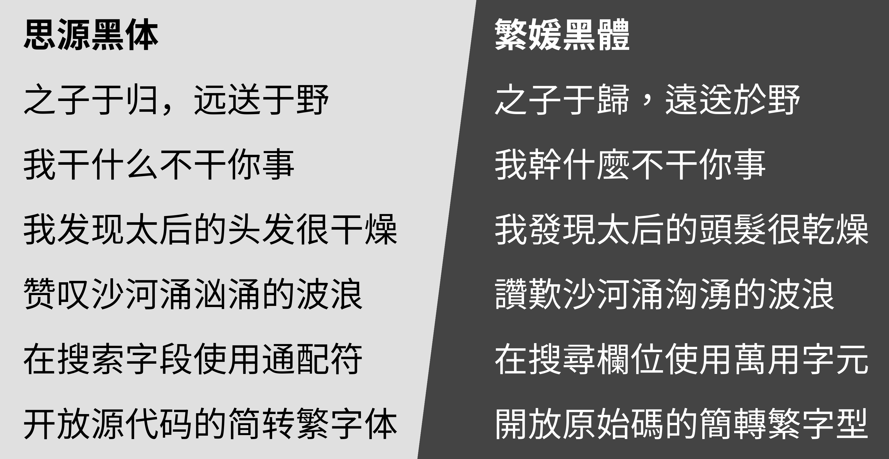

# Fan Wun Hak 繁媛黑體 

Fan Wun Hak is a Simplified-Chinese-to-Traditional-Chinese font based on [GenYoGothic](https://github.com/ButTaiwan/genyog-font). This font can handle the one-to-many problem in the conversion between Simplified Chinese and Traditional Chinese. GenYoGothic itself is a free font based on Source Han Sans. 
「繁媛黑體」是基於[源樣黑體](https://github.com/ButTaiwan/genyog-font)開發的簡轉繁字型，能處理「一簡對多繁」。源樣黑體是基於思源黑體的開放原始碼字型。

## Design 設計

See [_Correctly Implement a Simplified-Chinese-To-Traditional-Chinese Font_](https://ayaka.shn.hk/s2tfont/hant/) (in Chinese). 
參見[《正確實現簡轉繁字型》](https://ayaka.shn.hk/s2tfont/hant/)。

## Download 下載

See [release page](https://github.com/ayaka14732/FanWunHak/releases). 
見[發佈頁](https://github.com/ayaka14732/FanWunHak/releases)。

## Build 構建

See [build script](.github/workflows/build.yml). 
參見[建置腳本](.github/workflows/build.yml)。

## License 授權條款

This Font Software is licensed under the SIL Open Font License, Version 1.1. 
本字型以 SIL Open Font License 版本 1.1 發佈。

## See Also 另見

Serif font: [Fan Wun Ming](https://github.com/ayaka14732/FanWunMing). 
襯線字體：[繁媛明朝](https://github.com/ayaka14732/FanWunMing)。
